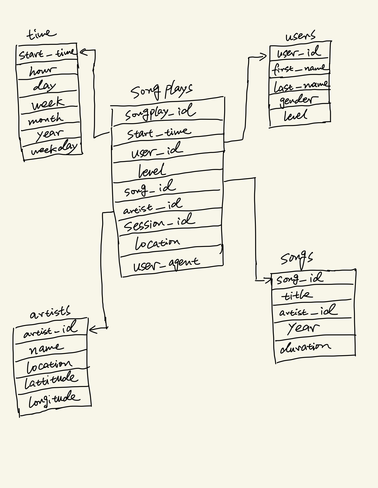

# Data_Warehouse_AWS

## Introduction 
A music streaming startup, Sparkify, has grown their user base and song database and want to move their processes and data onto the cloud. Their data resides in S3, in a directory of JSON logs on user activity on the app, as well as a directory with JSON metadata on the songs in their app.

The purpose of this project is building an ETL pipeline that extracts their data from S3, stages them in Redshift, and transforms data into a set of dimensional tables for their analytics team to continue finding insights in what songs their users are listening to. And be able to test your database and ETL pipeline by running queries given  by the analytics team from Sparkify and compare your results with their expected results.

## Cloud Technology 

**Amazon S3**: Amazon S3 stands for Simple Storage Service. It is an object storage service that offers industry-leading scalability, data availability, security, and performance. In this project, the Songs and Log datasets resides in a public S3 bucket "udacity-dend" whosee path is as follows: https://s3.console.aws.amazon.com/s3/buckets/udacity-dend/?region=ca-central-1&tab=overview. 

**Amazon Redshift**: Amazon Redshift is a data warehouse product which forms part of the larger cloud-computing platform Amazon Web Services. An Amazon Redshift data warehouse is a collection of computing resources called nodes, which are organized into a group called a cluster.Each cluster runs an Amazon Redshift engine and contains one or more databases. Our goal is to transform the data in S3 into dimension tables and fact table and load into Amazon Redshift. 

## Configuration (IMPORTANT!!!) 

```
[CLUSTER]
HOST= 
DB_NAME= 
DB_USER= 
DB_PASSWORD= 
DB_PORT= 

[IAM_ROLE]
ARN= 

[S3]
LOG_DATA='s3://udacity-dend/log_data'
LOG_JSONPATH='s3://udacity-dend/log_json_path.json'
SONG_DATA='s3://udacity-dend/song_data'
```

In the dwh.cfg file, you will see the following configuration above. All those information can be filled when you create your IAM role and Redshift Cluster, due to security reason, I CANNOT make my configuration public. 

## Data Description 

**Song Data** 
The first dataset is a subset of real data from the Million Song Dataset. Each file is in JSON format and contains metadata about a song and the artist of that song. The files are partitioned by the first three letters of each song's track ID. For example, here are filepaths to two files in this dataset.

```song_data/A/B/C/TRABCEI128F424C983.json song_data/A/A/B/TRAABJL12903CDCF1A.json```

And below is an example of what a single song file, TRAABJL12903CDCF1A.json, looks like.

```{"num_songs": 1, "artist_id": "ARJIE2Y1187B994AB7", "artist_latitude": null, "artist_longitude": null, "artist_location": "", "artist_name": "Line Renaud", "song_id": "SOUPIRU12A6D4FA1E1", "title": "Der Kleine Dompfaff", "duration": 152.92036, "year": 0}```

**Log Data** 

The second dataset consists of log files in JSON format which has the Song play activity logs from a music streaming app based on specified configurations.

The log files are partitioned by year and month. For example, here are filepaths to two files in this dataset.

```log_data/2018/11/2018-11-12-events.json log_data/2018/11/2018-11-13-events.json```

And below is an example of what the data in a log file, 2018-11-12-events.json, looks like.


## End Goal 
The data from Staging tables are loaded into a new Redshift datawarehouse named as dwh which is modeled based on star schema design. This includes the following tables.

**Fact Table**
songplays - records in log data associated with song plays i.e. records with page NextSong
songplay_id, start_time, user_id, level, song_id, artist_id, session_id, location, user_agent

**Dimension Tables**
* users - users in the app<br/>
user_id, first_name, last_name, gender, level
* songs - songs in music database<br/>
song_id, title, artist_id, year, duration
* artists - artists in music database<br/>
artist_id, name, location, lattitude, longitude
* time - timestamps of records in songplays broken down into specific units<br/>
start_time, hour, day, week, month, year, weekday



## Instructions
If you have your IAM Role and Redshift created in the AWS, you can create the table and go through ETL process using the following command in the terminal: 

```
python3 create_tables.py 
python3 etl.py
```

All the data would be transformed and loaded onto the Redshift you created on AWS.
